# User guide

## Views
### Panels
The panels are available on every single page of the website.

#### Top panel
On the top left corner, a click on `htest` will redirect you to the [dashboard](#dashboard).

#### Side panel
You will find here three different buttons, [`Dashboard`](#dashboard), [`Test trees library`](#test-trees-library) and [`Machines tests`](#machines-tests). A click on one of these buttons will redirect you to the associated page.

### Dashboard
All dashboard data is currently fake, and does not have any real link with the project's content.

### Test trees library
#### Display tree families
The first time you reach the test trees library you will face an empty library.

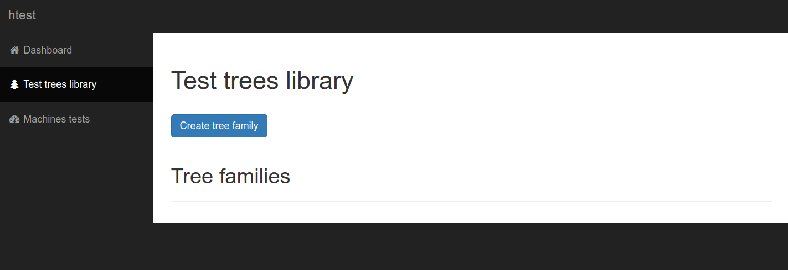

#### Add new tree family
To add a new tree family in the library, click the `Create tree family` button.

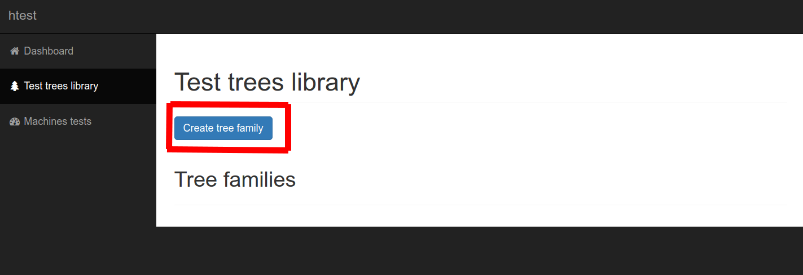

You will now face the `Create tree family` view.

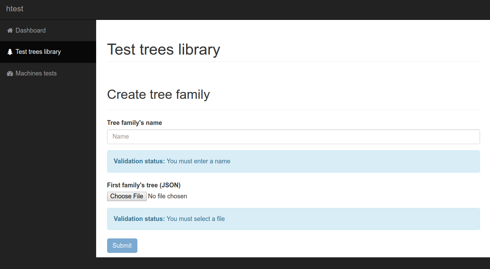

Fill the `Tree family's name` field with the desired family name. Look at the validation status field.

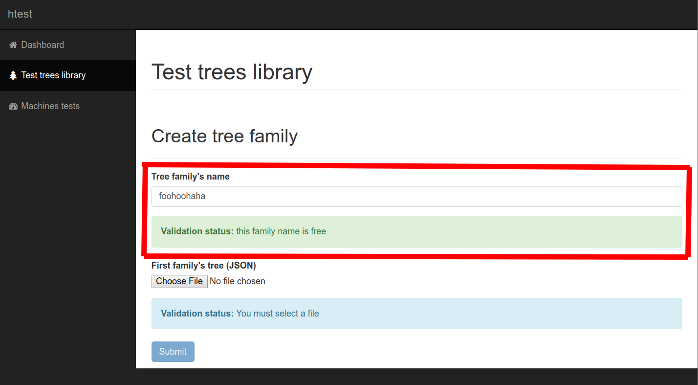

Now we will send the content of the first tree to the server. *Wtf are you talking about? See [`Test tree format documentation`](#test-trees-format)*. Click on the `Choose file` button.

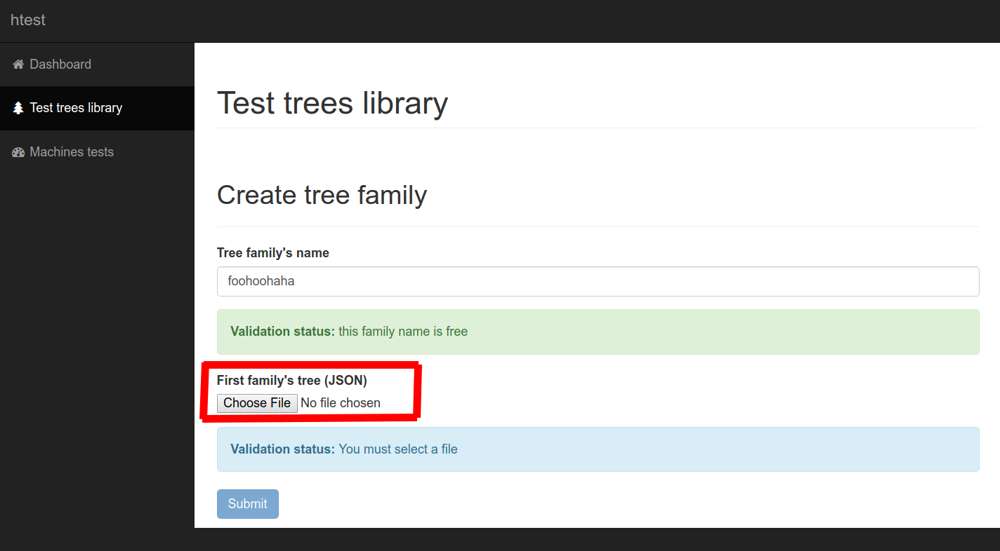

Select the tree you want to use.

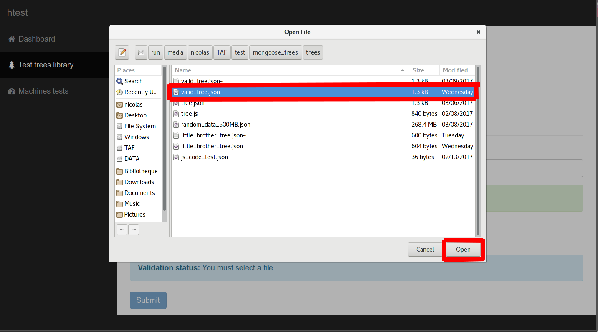

The file will be sent to the server, which will instantly validate or reject it, depending on its content validity. Errors or success messages will appear in the validation status field.

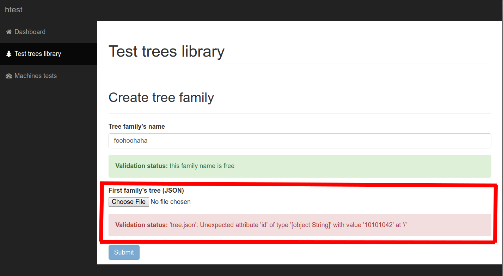

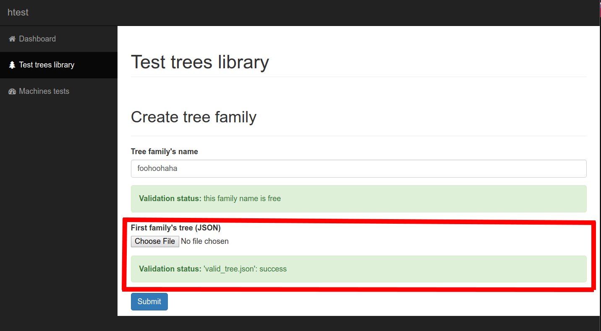

Once every validation field reaches a successfull state, you can click on the `Submit` button.

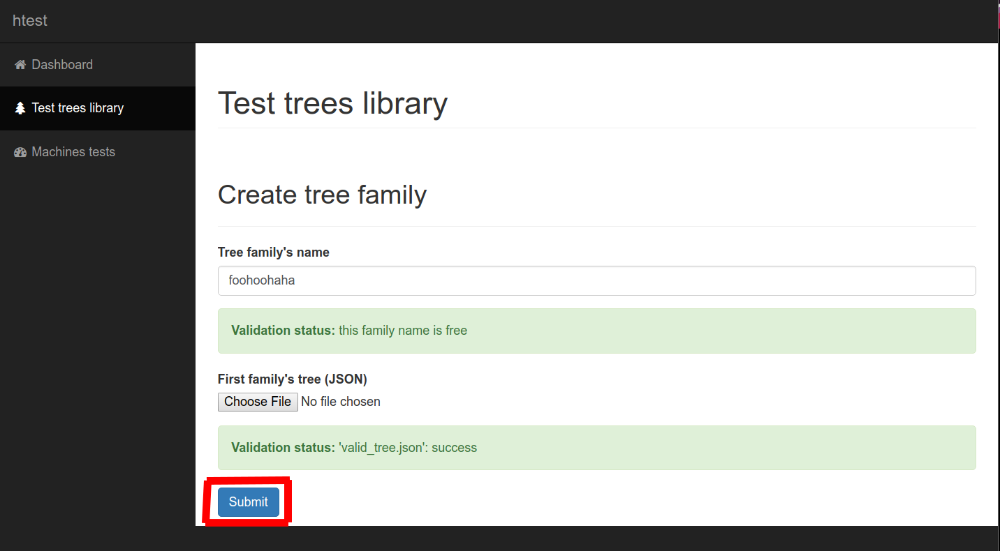

If everything goes well, you will reach the `Test trees library` page, the same as when you click on the button `Test trees library` on the left panel, but this time we can find the previously added tree family in a list.

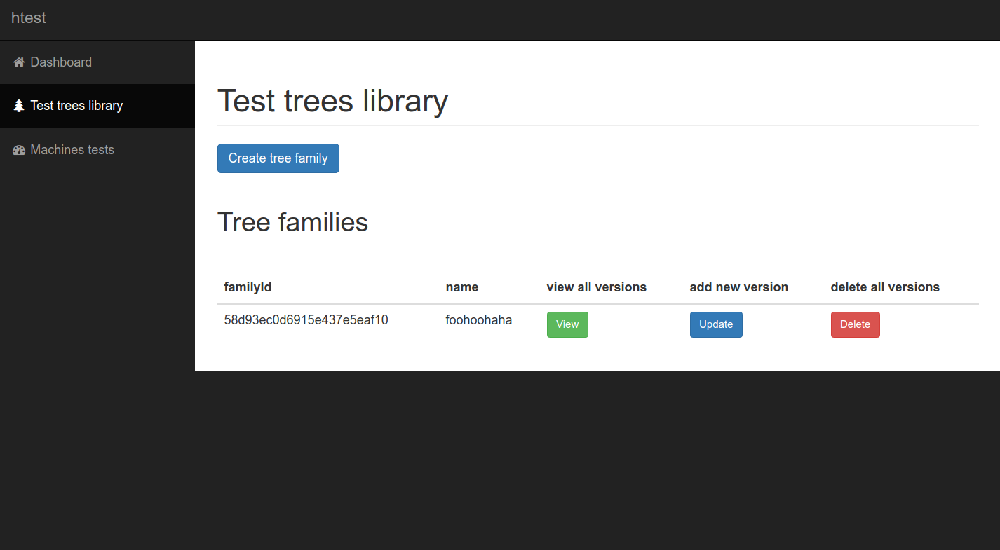

#### Tree families actions

You can see tree different buttons associated with the tree family, `View`, `Update` and `Delete`.

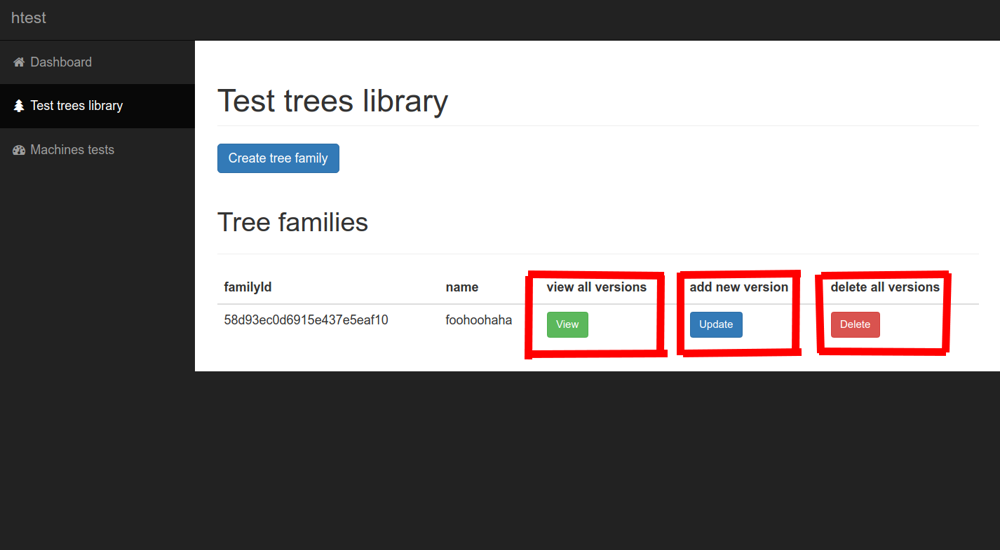

A click on the `View` button will bring you to the family details view. More details on the tree family view [here](#tree-family-view). To get back of this page, use the left panel to click on `Test tree library`.

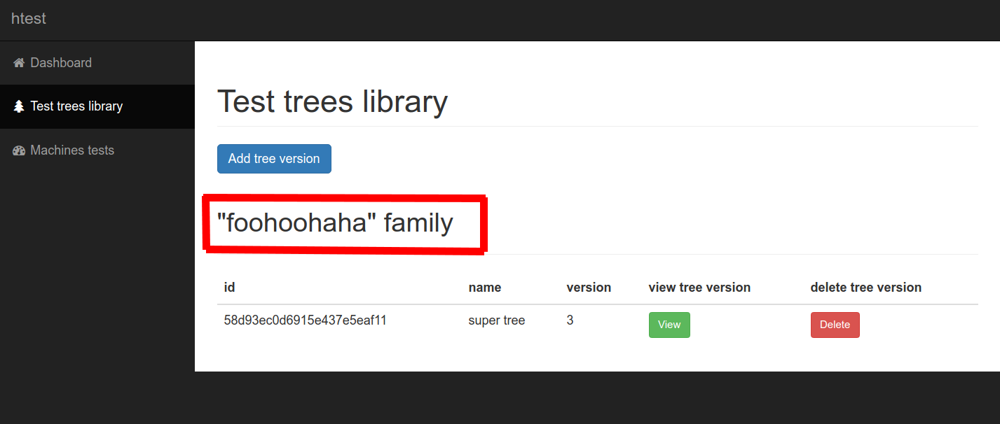

A click on the `Update` button will bring you to the family update view. More details on the tree family update view [here](#tree-family-update-view). To get back of this page, use the left panel to click on `Test tree library`.

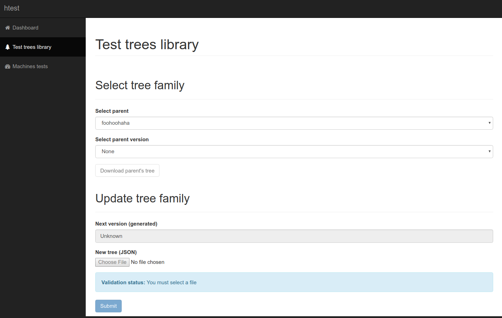

A click on the `Delete` button will delete the whole family. Be careful there is no confirmation message before deletion!

#### Tree family view
Foo

#### Tree family update view
Bar

### Machines tests
The machines tests page is not implemented, you cannot use it right now.

## Test trees format
Foobar
