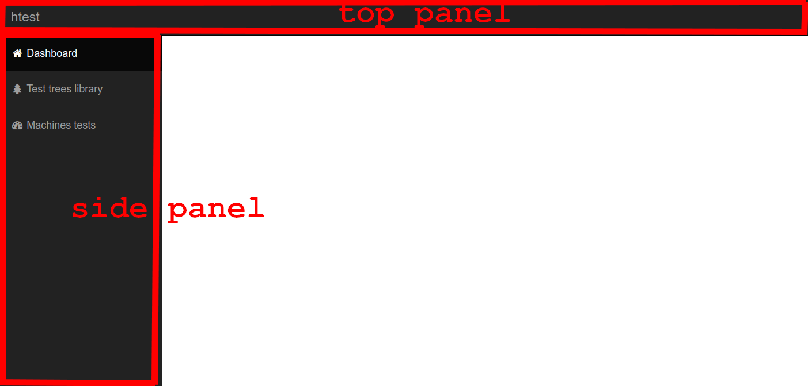

# User guide

## Panels
The panels are available on every single page of the website.

### Top panel
On the top left corner, a click on `htest` will redirect you to the [dashboard](#dashboard).

### Side panel
You will find here three different buttons, [`Dashboard`](#dashboard), [`Test trees library`](#test-trees-library) and [`Machines tests`](#machines-tests). A click on one of these buttons will redirect you to the associated page.

## Dashboard
All dashboard data is currently fake, and does not have any real link with the project's content.

## Test trees library
*(incoming)*

## Machines tests
The machines tests page is not implemented, you cannot use it right now.
