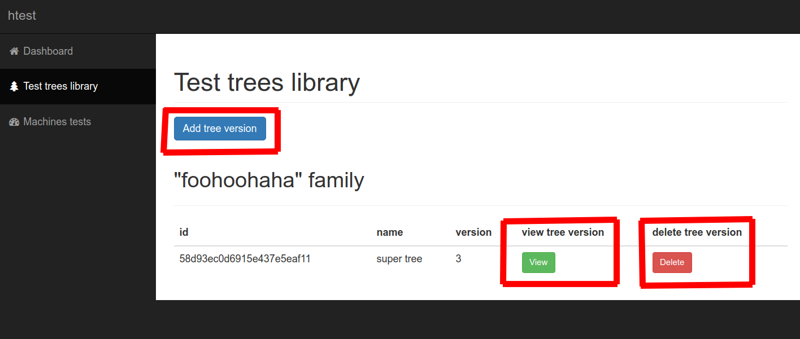
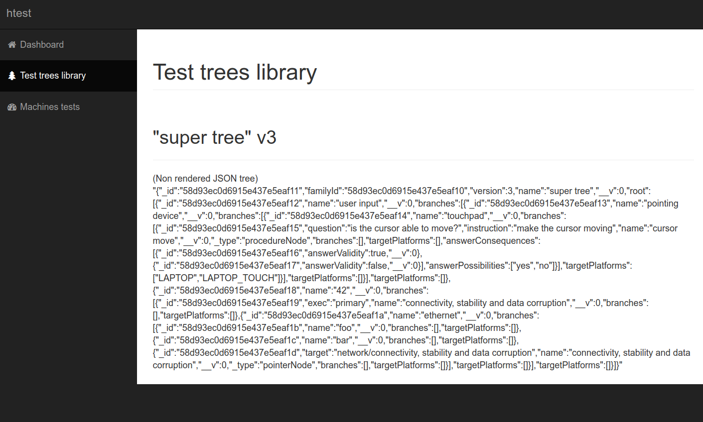
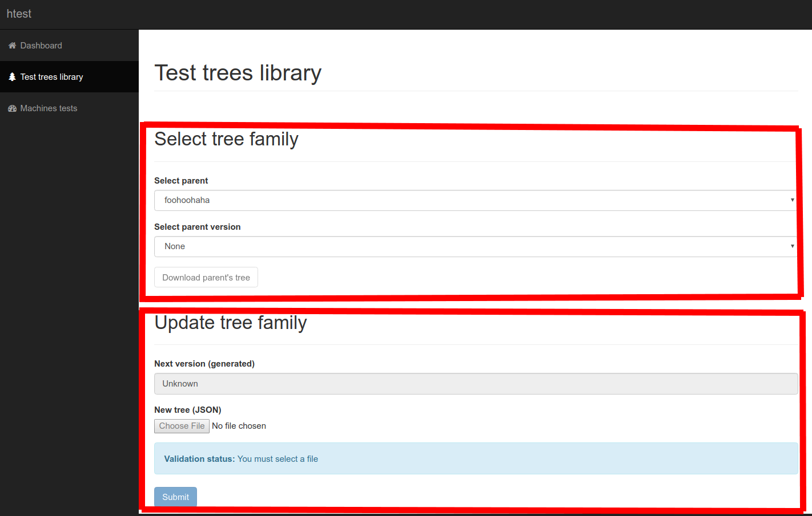
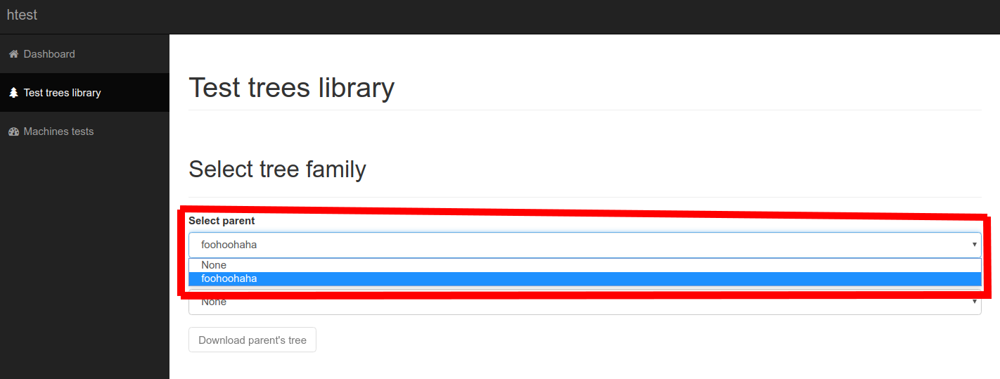
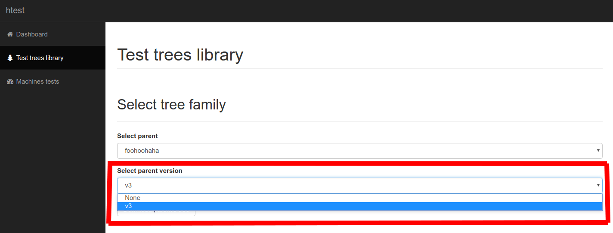
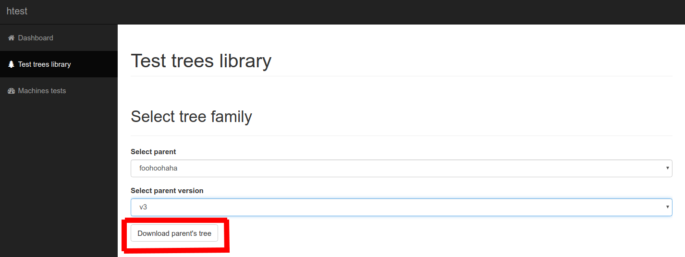
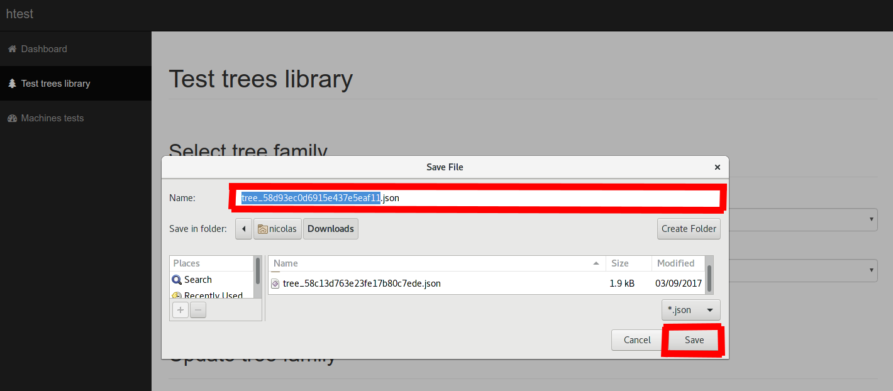
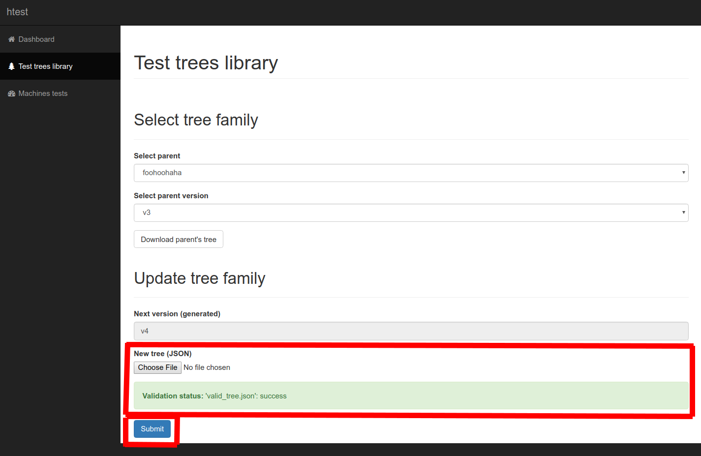
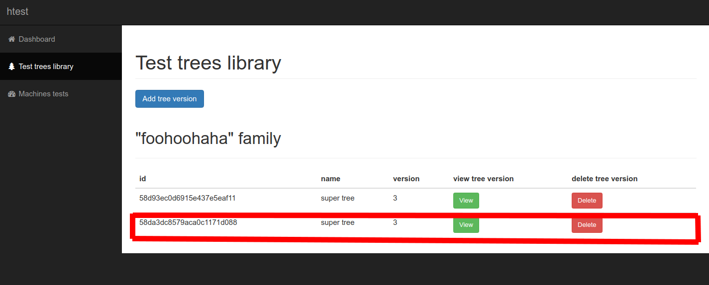

# User guide

## Views
### Panels
The panels are available on every single page of the website.


#### Top panel
On the top left corner, a click on `htest` will redirect you to the [dashboard](#dashboard).

#### Side panel
You will find here three different buttons, [`Dashboard`](#dashboard), [`Test trees library`](#test-trees-library) and [`Machines tests`](#machines-tests). A click on one of these buttons will redirect you to the associated page.

### Dashboard
All dashboard data is currently fake, and does not have any real link with the project's content.

### Test trees library
#### Display tree families
The first time you reach the test trees library you will face an empty library.


#### Add new tree family
To add a new tree family in the library, click the `Create tree family` button.


You will now face the `Create tree family` view.


Fill the `Tree family's name` field with the desired family name. Look at the validation status field.


Now we will send the content of the first tree to the server. *Wtf are you talking about? See [`Test tree format documentation`](#test-trees-format)*. Click on the `Choose file` button.


Select the tree you want to use.


The file will be sent to the server, which will instantly validate or reject it, depending on its content validity. Errors or success messages will appear in the validation status field.


Once every validation field reaches a successfull state, you can click on the `Submit` button.


If everything goes well, you will reach the `Test trees library` page, the same as when you click on the button `Test trees library` on the left panel, but this time we can find the previously added tree family in a list.


#### Tree families actions

You can see tree different buttons associated with the tree family, `View`, `Update` and `Delete`.


A click on the `View` button will bring you to the family details view. More details on the tree family view [here](#tree-family-view). To get back of this page, use the left panel to click on `Test tree library`.


A click on the `Update` button will bring you to the family update view. More details on the tree family update view [here](#tree-family-update-view). To get back of this page, use the left panel to click on `Test tree library`.


A click on the `Delete` button will delete the whole family. Be careful there is no confirmation message before deletion!

#### Tree family view
On a tree family view you are able to see all trees contained in a tree family, here `foohoohaha` family contains `super tree`.


You can see three different kinds of buttons associated with the family and its trees, `Add version`, `View` and `Delete`.



The `Add version` button will redirect you to the [tree family update view](#tree-family-update-view), the same view which is reachable from the tree families view, through the `Update` button.


A click on the `View` button will give you access to a raw view of the tree's data.



A click on the `Delete` button will delete the desired tree. Be careful there is no confirmation message before deletion!

#### Tree family update view
Here we face the tree family update view. This view goal is to let you add a new tree inside an existing family.


We can break this view into two main components, the parent selector (`Select tree family`) and the updater (`Update tree family`).



The selection of a parent family and its version is mandatory to unlock the `Update tree family` fields. Lets select the tree family we will use as a parent.



Then we select a tree version. Note that even if the parent tree version selection is mandatory, it only gives you an access to download the selected tree. It does not impact how the selected tree version will be linked to the new added one.



Once we have selected a family and a tree inside of the family, we may want to download the selected tree. For that, just click the `Download` button.



Then download the tree as a `.json` file in your computer. *Wait, wtf am I supposed to do with that? See [`Test tree format documentation`](#test-trees-format)*



Once we have passed the parent selection, the updater fields are now unlocked. Now we can upload a new tree in the family. The upload, validation and submission fields work the same way than the [`Create tree family` view](#add-new-tree-family). *For more details about the tree format, see [`Test tree format documentation`](#test-trees-format)*.



After a successfull submission, you will be redirected to the [`Tree family view`](#tree-family-view), were you can see the newly added list appearing in the list.



### Machines tests
The machines tests page is not implemented, you cannot use it right now.

## Test trees format
Test trees are represented as json data.

*Note: For a clearer idea of which items can be contained in a tree or node object, please refer to the [`tree grammar definition`](../models/treeGrammar.js).*

### Tree format
A tree object can be described by its meta data and its content. Its content is everything inside `root` (its root nodes). Its meta data are represented by the other fields.
```js
{
  "name": "tree name",
  "version": 1, // version id, must be a number
  "root": [] // here come the nodes (root nodes), see `Nodes format` in next section
}
```

### Nodes format
A node object can take three different shapes, an abstract node, an instruction node and a pointer node. Every different shape has a slightly different meaning.

#### Abstract node format
An abstract node is supposed to represent pretty everything not entirely determnined, like a category.
```js
{
  "name": "node name",
  "exec": "PRIMARY", // "PRIMARY" -> node will be executed in any case, "SECONDARY" -> node will only be executed if called from a pointer node
  "targetPlatforms": ["LAPTOP", "LAPTOP_TOUCH"], // flags to validate or not the accuracy of a node targeting an hardware platform
  "branches": [] // here come the nodes (branch nodes)
}
```

#### Instruction node format
An instruction node is supposed to fact check something, by giving instructions then asking a question, and to propose a set of answers and their meaning, which respond to the checked fact.
```js
{
  "name": "cursor move",
  "instruction": "make the cursor moving", // thing to do to get a precise setup/environment
  "question": "is the cursor able to move?", // question refering to things inside the previously defined setup
  "answerPossibilities": ["yes", "no", "maybe"], // anwser possibilites to the previous question
  "answerConsequences": [true, false, "/root/user input/pointing device/touchpad/cursor move"] // meaning of each question, as boolean or as a pointer to another node
  "branches": []
}
```

#### Pointer node format
A pointer node is a kind of duplication of an other node, but only by its meaning. In fact a pointer looks like a postal address refering to a precise location. The pointer/address is not the location, but the location is refered by its postal address.
```js
{
  "name": "test",
  "target": "/root/network/lol" // pointer address
}
```

### Full tree example
```js
{
  "name": "super tree",
  "version": 3,
  "root": [
    {
      "name": "user input",
      "branches": [
        {
          "name": "pointing device",
          "branches": [
            {
              "name": "touchpad",
              "targetPlatforms": ["LAPTOP", "LAPTOP_TOUCH"],
              "branches": [
                {
                  "name": "cursor move",
                  "instruction": "make the cursor moving",
                  "question": "is the cursor able to move?",
                  "answerPossibilities": ["yes", "no", "maybe"],
                  "answerConsequences": [true, false, "/root/user input/pointing device/touchpad/cursor move"]
                }
              ]
            }
          ]
        }
      ]
    },
    {
      "name": "network",
      "branches": [
        {
          "name": "lol",
          "exec": "PRIMARY",
          "branches": []
        },
        {
          "name": "ethernet",
          "branches": [
            {
              "name": "foo"
            },
            {
              "name": "bar"
            },
            {
              "name": "test",
              "target": "/root/network/lol"
            }
          ]
        }
      ]
    }
  ]
}
```
